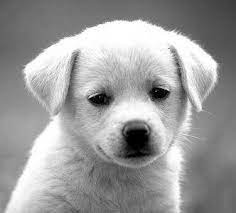
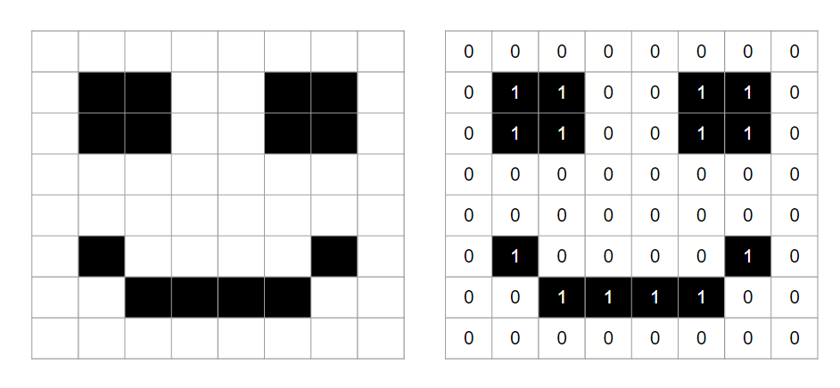
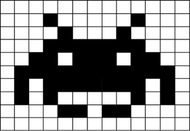

# Implementation of Edge Detection and Hole Filling for Binary and Grayscale Images

After implementing, use grayscale and binary images as inputs and report the results. Compare the edge detection results on grayscale images using the log filter method on the Lena image.

#### Grayscale Images:

  

  

#### Binary Images:

  

  

#### Lena Image:

  

