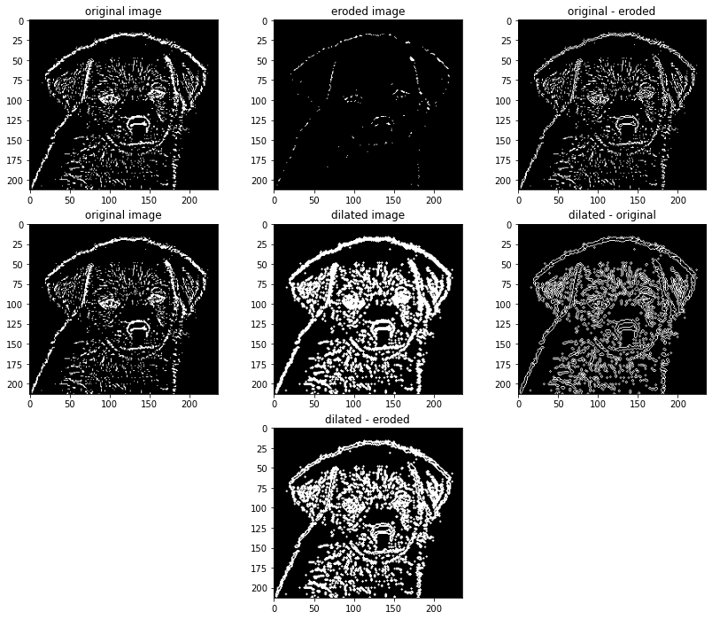
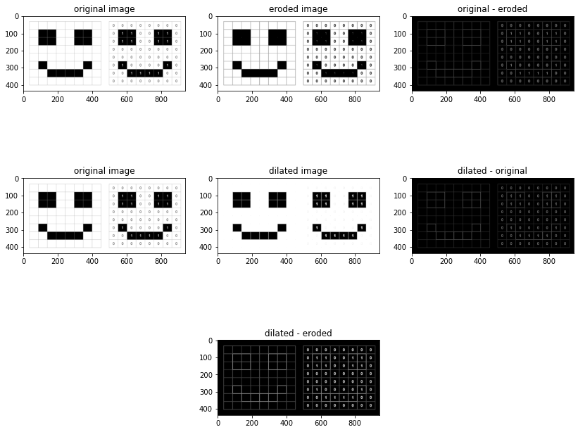

# 🖼️ Edge Detection & Hole Filling in Images  

This project explores **image processing techniques** for **edge detection** and **hole filling** on both **binary** and **grayscale images**, and compares results with the **Laplacian of Gaussian (LoG) filter** on the Lena image.  

The goal is to show how different morphological operations (erosion, dilation, and combinations) and filtering methods can reveal edges, enhance structures, and fill missing parts in images.  

---

## ✨ Features  

🔍 **Edge Detection Techniques**  
- **Erosion-based edges** → Shrinks objects to highlight boundaries.  
- **Dilation-based edges** → Expands objects to highlight differences.  
- **Combined method** → Uses both erosion and dilation for sharper results.  

🖤 **Binary Image Processing**  
- Converts grayscale to binary.  
- Detects object boundaries clearly.  
- Fills internal holes in objects for a clean structure.  

🌈 **Grayscale Image Processing**  
- Edge detection applied directly on grayscale images.  
- Shows contrast between object interiors and edges.  

👩‍🎨 **Laplacian of Gaussian (LoG) on Lena**  
- Smooths the image with Gaussian blur.  
- Applies Laplacian filter to capture sharp transitions.  
- Produces clean, thin edges.  

---

## 📊 Results  

For each input, the project generates:  

1️⃣ **Original Image**  
2️⃣ **Erosion Result** – shrinks regions, edges become visible.  
3️⃣ **Dilation Result** – expands regions, highlights transitions.  
4️⃣ **Combined Method** – difference between dilation and erosion (strong edge map).  
5️⃣ **Hole Filling** – binary objects become solid, no internal gaps.  
6️⃣ **LoG on Lena** – high-quality edge detection with smooth contours.  

  

  

  

---

## 🏆 Highlights  

✨ Works on **both binary and grayscale images**.  
✨ Demonstrates **morphological edge detection** clearly.  
✨ Shows how **LoG filter outperforms basic methods** for natural images.  
✨ Produces **visual comparisons** for better understanding.  

---
